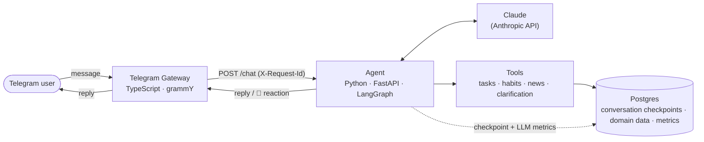

# max

[](https://github.com/HilelLustiger/max/actions/workflows/ci.yml)
[](LICENSE)
[](Agent/pyproject.toml)
[](Telegram/package.json)

A personal assistant AI agent, reachable via Telegram, running in production on Railway.

`max` handles task and habit tracking, and curates personalized news digests from RSS feeds, through a single conversational interface — all backed by a channel-agnostic agent core built as the foundation for a larger roadmap (web UI, Chrome extension, MCP-server-powered skills).

## Architecture



Each service owns its dependencies, tests, and deploy; the Telegram Gateway is a thin, replaceable adapter — the Agent has no knowledge of Telegram at all, so the same `/chat` API can grow a web frontend or Chrome extension later without touching the reasoning core. See [docs/DOMAIN.md](docs/DOMAIN.md) for the project's glossary.

## Highlights

- **Model-agnostic LLM layer** — an `LLMProvider` protocol (`Agent/app/llm/contract.py`) decouples orchestration from any specific vendor; swapping providers or adding a second one requires no changes outside `app/llm/`.
- **LangGraph orchestration with real interrupts** — multi-turn clarification ("which task did you mean?") is built on LangGraph's native `interrupt()` / `Command(resume=...)`, not hand-rolled state; conversation memory is a `PostgresSaver` checkpoint, kept within a token budget per call via `trim_messages`.
- **Tool-calling agent** — task and habit tracking, plus an RSS-based news digest pipeline (topic subscriptions, cross-feed dedup, LLM-summarized digests) are exposed to the model as tools (`Agent/app/tools/`), routed through a generic `ToolNode` result-processing pipeline.
- **Cost and performance visibility** — every LLM call is recorded to `llm_metrics` (tokens, latency, estimated cost, including prompt-cache reads/writes), queryable via a metrics report script — not an afterthought bolted on later.
- **Full request traceability** — structured JSON logging across every service, correlated end-to-end by a `request_id` generated at the Telegram edge and threaded through Agent logs and DB rows: one user message, one grep.
- **Two-tier testing** — a fast unit tier (no Docker) enforced on every commit, and a full integration tier (real Postgres, real cross-service contract) enforced on every push, both mirrored in CI.
- **Decisions on record** — architecturally significant choices (e.g. moving conversation memory to a LangGraph checkpointer, replacing hand-rolled clarification state with `interrupt()`) are captured as ADRs before being built, not reconstructed from memory afterward.

## Structure

```
max/
├── Agent/               # Python/FastAPI — the agent: LangGraph orchestration, LLM calls, tools, persistence
├── DB/                  # shared Python package — Postgres models, Alembic migrations
├── Telegram/            # TypeScript/grammY — Telegram gateway, calls Agent's /chat
├── Integration/         # cross-service tests: boots a real Agent against real Postgres
├── scripts/             # root-level dev scripts (see Local development below)
└── .github/workflows/   # CI: delegates to each service's own scripts/ci.sh
```

Each service lives in its own top-level directory and owns its own dependencies, tests, and build — the root of this repo only orchestrates (CI, docs, cross-cutting decisions). Future services (frontend, Chrome extension) will each get their own top-level directory the same way.

## Status

- **Agent** — implemented and working end-to-end. `/chat` runs a LangGraph model-call loop (`ToolNode` + conditional edges) over Claude, with conversation memory backed by a Postgres-checkpointed thread and multi-turn clarification handled via native `interrupt()`. Tools are wired in for task tracking (`create_task`, `list_tasks`, `complete_task`), habit tracking (`create_habit`, `list_habits`, `log_habit`), and a news digest pipeline (`create_topic`, `list_topics`, `fetch_news_entries`, `summarize_news`).
- **DB** — shared Postgres models + Alembic migrations, used by `Agent`. Covers conversation checkpoints, LLM metrics, task/habit/goal tracking, and news topics with cross-feed delivery dedup.
- **Telegram** — verified end-to-end against a real bot, both running locally and via its built Docker image. Forwards messages to `Agent`'s `/chat` over long polling and reacts to incoming messages (👀) while a reply is in flight.
- **Logging** — structured JSON across all services, correlated by a `request_id` generated by the Telegram gateway and propagated through Agent's logs and DB rows, so one message is traceable end-to-end with a single grep.
- **Deployed on Railway** — `Agent` and `Telegram` run as separate services against a managed Railway Postgres, communicating over Railway's private network. Migrations run automatically via a pre-deploy command on every deploy. Verified with real Telegram messages end to end in production, including real tool calls.

## Tech stack

| Layer | Choices |
|---|---|
| Agent | Python 3.12, FastAPI, LangGraph, LangChain (Anthropic), Pydantic Settings |
| Gateway | TypeScript, grammY, tsx |
| Data | Postgres, SQLAlchemy, Alembic, `langgraph-checkpoint-postgres` |
| LLM | Claude (Anthropic API), model-agnostic provider layer, prompt caching |
| Ops | Docker Compose (local Postgres), GitHub Actions CI, Railway (deploy), structured JSON logging |
| Testing | pytest (unit + integration tiers), Node's built-in test runner, pre-commit/pre-push hooks |

## Local development

Requires [`uv`](https://docs.astral.sh/uv/), Node 24+, and Docker (for Postgres).

### First-time setup

Each service reads its own `.env` (copy from that service's `.env.example` — e.g. `Agent/.env`, `Telegram/.env`). Local Postgres credentials/`DATABASE_URL` are the one exception: they live in a root `.env` (copy from the root `.env.example`), read by both `docker-compose.yml` and `scripts/env.sh` (sourced by the scripts below) — a single source of truth instead of that connection string being duplicated across scripts.

### Run the stack

```
scripts/run.sh
```

Brings up Postgres, applies migrations, and starts the Agent on `localhost:8000`. Also starts the Telegram gateway if `Telegram/.env` has a `TELEGRAM_BOT_TOKEN` set — otherwise it just runs the Agent so you can hit `/chat` directly:

```
curl -s localhost:8000/chat -H "Content-Type: application/json" \
  -d '{"channel": "test", "external_id": "me", "text": "hello"}'
```

You can also run a single service on its own, e.g. `Agent/scripts/run.sh` or `Telegram/scripts/run.sh` (each `cd`s and sets up its own deps).

### Run tests

Tests are split into two tiers:

- **Unit** — no Postgres, no Docker, fast. `scripts/test.sh` (or per-service: `Agent/scripts/test.sh`, `Telegram/scripts/test.sh`).
- **Integration** — needs a real Postgres, spins one up itself. `scripts/test-integration.sh` (or per-service: `DB/scripts/test.sh`, `Agent/scripts/test-integration.sh`, `Integration/scripts/test.sh`). Integration tests never call the real Anthropic API — Agent tests run against a `FakeProvider` that returns canned replies.

`scripts/dev-db.sh` is the shared helper both of the above (and `scripts/run.sh`) use to bring up Postgres and apply migrations — you shouldn't need to call it directly.

### Git hooks

```
pre-commit install -c .github/pre-commit-config.yaml --install-hooks
pre-commit install -c .github/pre-commit-config.yaml -t pre-push
```

Requires the [`pre-commit`](https://pre-commit.com/) tool (`pip install pre-commit` or `brew install pre-commit`). Once installed:

- **On `git commit`**: runs `scripts/test.sh` (the fast unit tier) automatically.
- **On `git push`**: runs `scripts/test-integration.sh` (the full tier) automatically.

To run either manually without committing/pushing: `pre-commit run -c .github/pre-commit-config.yaml fast-checks --hook-stage pre-commit` (or `integration-checks --hook-stage pre-push`).

## CI

`.github/workflows/ci.yml` runs one job per service. Each job does minimal environment setup (Node or Python) and then hands off entirely to that service's own `scripts/ci.sh`, which owns its install/lint/test/build steps (unit + integration together, since CI already has a real Postgres available). The root workflow never encodes service-specific commands directly — that keeps each service free to change its own tooling without touching CI config at the root.

## Deployment

`Agent` and `Telegram` deploy to Railway as independent services against a managed Postgres instance, communicating over Railway's private network. Database migrations run automatically via a pre-deploy command (`uv run --directory DB alembic upgrade head`) before each deploy, so schema and code stay in lockstep.

## License

[MIT](LICENSE)
